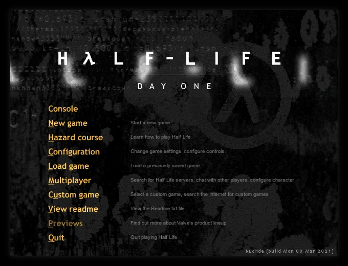
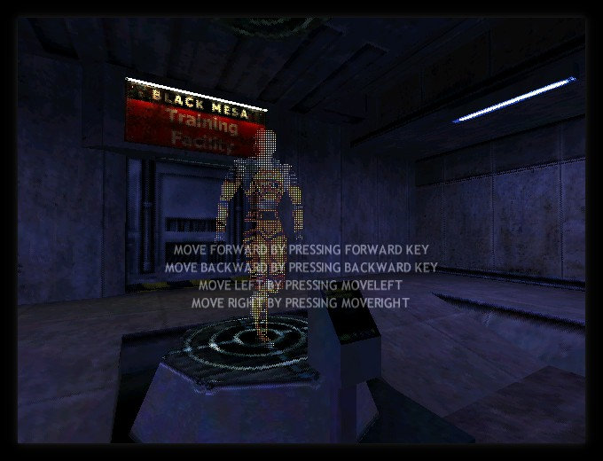
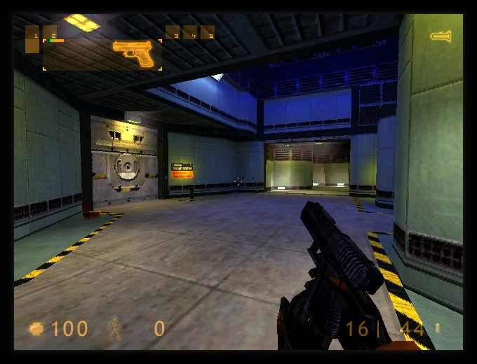
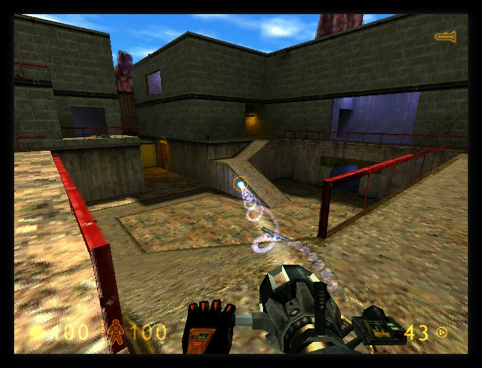

# FreeHL
Clean-room reimplementation of Half-Life: Deathmatch and Half-Life (Experimental).

Similar to FreeCS, this aims to recreate the feeling of the original game.
It's designed to work with the content from the CD version of the game.

Netplay improvements, such as prediction of both player physics and weapon-logic
are present.

This is 100% original code, feel free to audit however you wish.
No proprietary SDKs have been looked at or taken apart, unlike similar projects.

## Building
Clone the repository into the Nuclide-SDK:

> git clone REPOURL valve

then either run Nuclide's ./build_game.sh shell script, or issue 'make' inside
./valve/src!

Obviously make sure that Nuclide has fteqw and fteqcc set-up for building.

## Community
Join us on #halflife via irc.frag-net.com and chat.

## License
ISC License

Copyright (c) 2016-2021 Marco Hladik <marco@icculus.org>

Permission to use, copy, modify, and distribute this software for any
purpose with or without fee is hereby granted, provided that the above
copyright notice and this permission notice appear in all copies.

THE SOFTWARE IS PROVIDED "AS IS" AND THE AUTHOR DISCLAIMS ALL WARRANTIES
WITH REGARD TO THIS SOFTWARE INCLUDING ALL IMPLIED WARRANTIES OF
MERCHANTABILITY AND FITNESS. IN NO EVENT SHALL THE AUTHOR BE LIABLE FOR
ANY SPECIAL, DIRECT, INDIRECT, OR CONSEQUENTIAL DAMAGES OR ANY DAMAGES
WHATSOEVER RESULTING FROM LOSS OF MIND, USE, DATA OR PROFITS, WHETHER
IN AN ACTION OF CONTRACT, NEGLIGENCE OR OTHER TORTIOUS ACTION, ARISING
OUT OF OR IN CONNECTION WITH THE USE OR PERFORMANCE OF THIS SOFTWARE.
